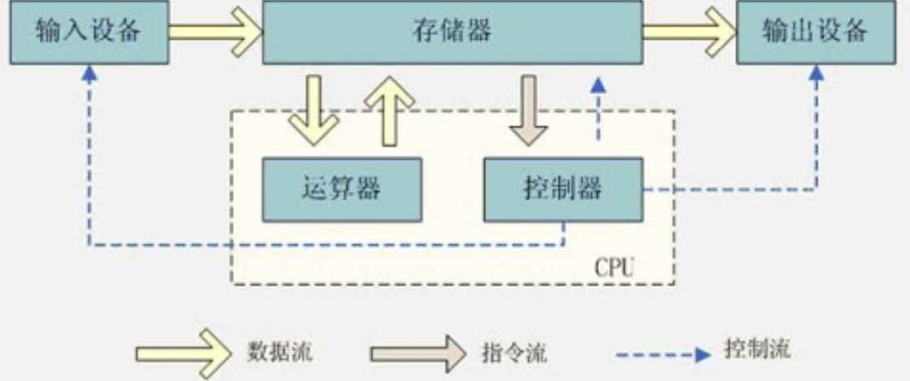

# 计算机的体系与结构

## 冯诺依曼和现代计算机体系

冯诺依曼体系：将程序指令和数据一起存储的计算机设计概念结构 目的：存储程序指令，设计通用电路

1. 必须有一个存储器
2. 必须有一个控制器
3. 必须有一个运算器
4. 必须有输入设备
5. 必须有输出设备

现代计算机的结构（解决cpu空转等待数据传输的问题）：存储器，运算器和控制器都在一块了，加强了cpu的处理能力，数据传输能力 cpu = 运算器+控制器+存储器

 

