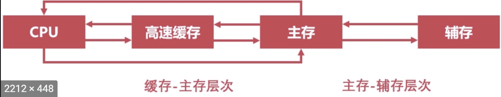

# 计算机总线和IO设备，存储器，CPU

## 计算机的总线：

USB（通用串行总线）提供了对外连接的接口，不同设备可以通过USB接口进行连接。还有PCI总线，ISA总线

总线的分类：片内总线和系统总线

      系统总线有以下三种：

1. 数据总线 ：双向传输各个部件的数据信息 位数是32位或者64位
2. 地址总线 ：指定源数据或目的数据在内存中的地址
3. 控制总线： 用来发出各种控制信号的传输线

##  总线仲裁

是为了解决总线使用权的冲突问题

1. 链式查询
2. 计时器定时查询
3. 独立请求

CPU与IO设备的通信有程序中断和DMA（直接存储器访问）

## 存储器

存储器的层次结构：cpu《---》缓存《----》主存《----》辅存， cpu直接和缓存连接，也可以和主存直接通信

主存就是内存RAM，磁盘是辅存：断电后，主存需要电去一段时间更新，所以会丢失数据。

## 控制器

### 1 程序计数器

1. 用来存储下一条指令的地址
2. 循环从程序计数器中拿出指令
3. 当指令被拿出时，指向下一条指令

### 2 时序发生器

1. 用于发送时序脉冲
2. CPU依据不同的时序脉冲有节奏的进行工作

### 3 指令译码器

1. 是控制器的主要部件之一
2. 计算机指令由操作码和地址码组成
3. 翻译操作码对应的操作以及控制传输地址码对应的数据

### 4 指令寄存器

1. 控制器的主要部件之一
2. 从主存或高速缓存取计算机指令

### 5 主存地址寄存器

1. 保存当前CPU正要访问的内存单元的地址

### 6 主存数据寄存器

1. 保存当前CPU正要读或写的主存数据

### 7 通用寄存器

1. 用于暂时存放或传送数据或指令
2. 可保存ALU的运算中间结果
3. 容量比一般专用寄存器要大

