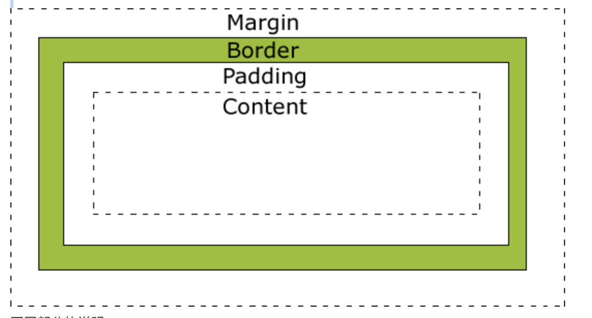

# CSS美化网页元素

## 字体样式

```text
span标签 突出字体

font-family:字体
font-size:字体大小
font-weight:字体粗细
color:字体颜色
font:oblique bolder 12px "Arial"; 对应字体风格，粗细，大小，字体
```

## 文本样式

```text
颜色color

文本对齐方式text-align

首行缩进text-indent:2em

行高height,line-height,行高和块的高度一致的话，能够实现上下局中

装饰 text-decoration

```

## 盒子模型及边框



margin：外边距

padding：内边距

border：边框

```text
box{
    对应边框大小，样式，颜色
    border:1px solid red 
}

margin:0 auto 居中的前提条件是要让他们放置在div块内
```

## 圆角边框

```text
<style>
div{
    width:100px;
    height:100px;
    border:10px solid red;
    border-radius:100px;
}
</style>
```


## 阴影

```text
<style>
div{
    width:100px;
    height:100px;
    border:10px solid red;
    box-shadow:10px 10px 100px yellow;
}
</style>
```

## 定位

```text
<body>
<div id="father">
    <div id="first">first box</div>
    <div id="second">second box</div>
    <div id="third">third box</div>
</div>    

</body>


div{
    margin:10px;
    padding:5px;
    font-size:12px;
    line-heighy:25px;
}

#father{
    border:1px solid red;
}

#first{
    border:1px solid yellow;
}

#second{
    border:1px solid blue;
}

#third{
    border:1px solid grey;
}


相对定位:相对于自己原来的位置进行偏移
position:relative; #上下左右
top:-20px;
left:20px;
bottom:20px;
right:20px;


绝对定位:基于xxx定位，上下左右
没有父级元素定位的前提下，相对于浏览器定位
如果父级元素存在定位，就会相对于父级元素定位
在父级范围内移动，不在标准文档流
position:absolute;


固定定位：位置固定
position:fixed


z-index
图层

```

